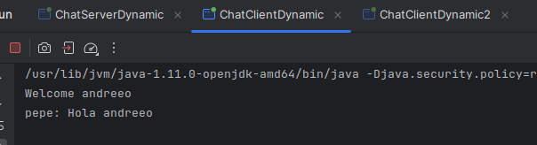

# Chat 1.0 - Java with RMI

Program in java based on chat to create a live communication

### Tools used
- IntelliJ IDEA Ultimate 2024.1 (projects contains all configurations used in projectname/.idea)

### Steps to run the chat program

## Run HTTP server

### Result

## Run RMIREGISTRY

## Run Server Dynamic

### Result

## Run Client Dynamic (user 1)

### Result

## Run Client Dynamic (user 2)

### Result

# Interaction between users

### License

MIT
